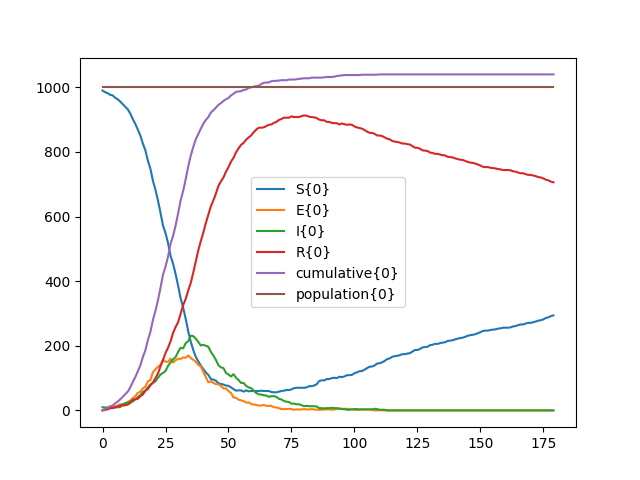

# IDM Compartmental Modeling Software (CMS) in a Docker Container

Includes Python interface example using [Python.NET](https://pythonnet.github.io/)

## Quick Start with Docker

### Get a local copy of the docker container image

**Option 1- skip to examples below and let Docker pull the requisite image**

**Option 2- pull the image from Docker Hub:**

```bash
docker pull clorton/idmcms:1.1
```

**Option 3- build the image locally:**

```bash
docker build --tag clorton/idmcms:1.1 .
```

### Run a Model with CMS

Options:

Note: the examples below use Unix/Linux bash syntax to get the current directory, `$(pwd)`. If running on Windows, explicitly list the current path in place of `$(pwd)`.

1. _Run the default model/command in the container (`python3 /cms/seir.py`)._

```bash
docker run --rm -it -v $(pwd):/host -w /host clorton/idmcms:1.1
```

This will write trajectory data to `trajectories.net.csv` and a plot to `trajectory.png` in the current directory, mapped to `/host` in the container. _The model is not modifiable as this default command runs the model included in the container. See options 2 or 3 for running other models._

2. _Run the model of your choice, written in EMODL, directly in CMS with the Mono .Net runtime.

```bash
docker run --rm -it -v $(pwd)/models:/host -w /host clorton/idmcms:1.1 mono /cms/compartments.exe --model seir.emodl --config seir.cfg
```

- Replace `$(pwd)/models` with your model directory path.
- Replace `seir.emodl` and `seir.cfg` with your model file and configuration, respectively.

This will write trajectory data to file specified in the configuration.

3. _Run a model, e.g. SEIR, with Python._

```bash
docker run --rm -it -v $(pwd)/models:/host -w /host clorton/idmcms:1.1 python3 seir.py --png
```

This example, called from the root of the repository on your machine or codespace, runs the example `seir.py`, SEIR model implemented in Python and writes `trajectories.net.csv` and `trajectory.png` into the mapped directory (`./models` in the example).

### Sample Output

#### SEIR Trajectory Data (CMS)

```text
FrameworkVersion,"1.0.176.23","clorton (CMS/Main/framework)"
sampletimes,0,1,2,3,...,179,180
S{0},990,983,979,975,...,372,375
E{0},0,5,7,7,...,0,0
I{0},10,10,12,10,...,0,0
R{0},0,2,2,8,...,628,625
cumulative{0},0,7,11,15,...,938,938
population{0},1000,1000,1000,1000,...,1000,1000
```

Note that CMS can run multiple realizations of the model in a single invocation. The realization index is appended to each column to differentiate results from separate realizations.

#### SEIR Trajectory Data (Python)

```text
,S{0},E{0},I{0},R{0},cumulative{0},population{0}
0,990.0,0.0,10.0,0.0,0.0,1000.0
1,985.0,4.0,9.0,2.0,5.0,1000.0
2,982.0,6.0,9.0,3.0,8.0,1000.0
3,977.0,9.0,7.0,7.0,13.0,1000.0
...
178,292.0,0.0,0.0,708.0,1040.0,1000.0
179,294.0,0.0,0.0,706.0,1040.0,1000.0
```

Note that Python trajectory data comes from a Pandas Dataframe and omits the "index" column name in the first column of the first row.

#### SEIR Trajectory Plot (Python)



## Additional Information and Documentation

- [PyCMS](https://github.com/InstituteforDiseaseModeling/pycms) : The initial motivation for packaging CMS in a container.
- [IDM-CMS](https://github.com/InstituteforDiseaseModeling/IDM-CMS) : Source code and documentation for the CMS engine.
